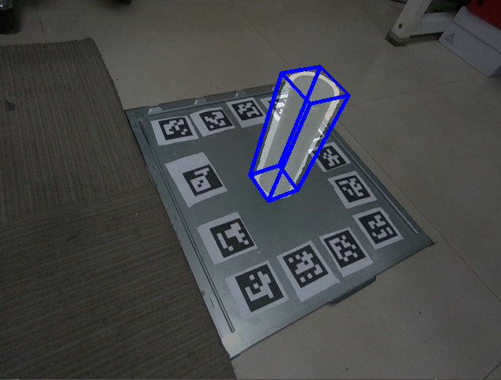
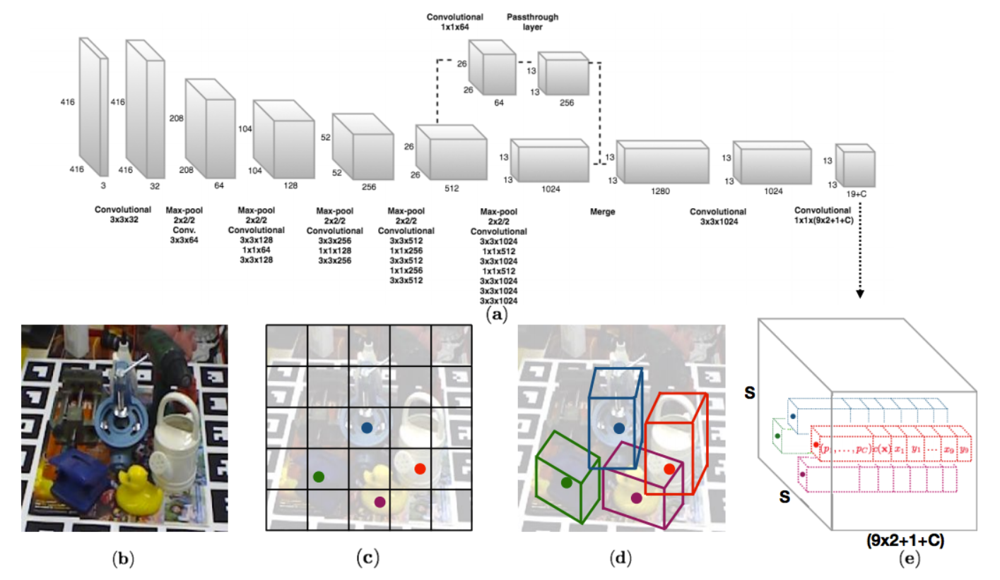
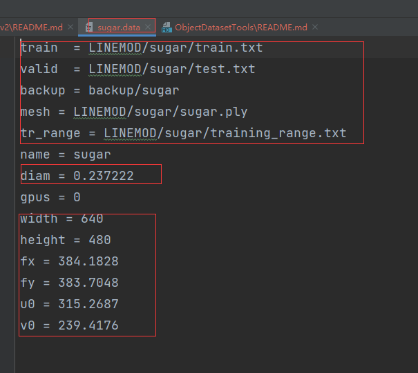
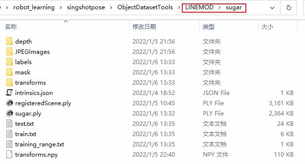
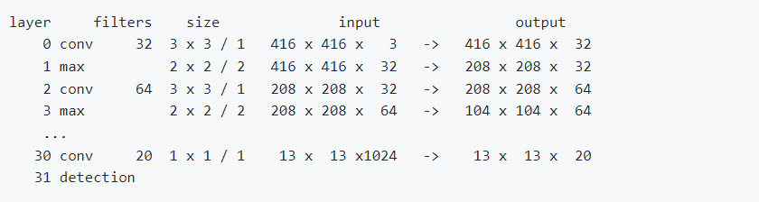

# 算法：预测 3D目标在2维平面的 8个包围框点


## 介绍
我们提出了一种 one-shot 方法，用于同时检测 RGB 图像中的目标并预测其 6D 姿态，而无需多个阶段或必须检查多个假设。我们方法的关键组件是受 YOLO 网络设计启发的新 CNN 架构，该架构直接预测对象 3D 边界框投影顶点的 2D 图像位置。然后使用 PnP 算法估计对象的 6D 姿态。 [Paper](http://openaccess.thecvf.com/content_cvpr_2018/papers/Tekin_Real-Time_Seamless_Single_CVPR_2018_paper.pdf), [arXiv](https://arxiv.org/abs/1711.08848)



## 环境
该代码在 windows/linux, cuda10.1, cudnn v5.1进行了测试。代码基于 python 3.6+, Pytorch 0.4.1+实现。

## 数据集准备

### LINEMOD数据集
在主代码目录中，运行以下命令下载并提取 
 1) 预处理的 LINEMOD 数据集
 2) LINEMOD 数据集的训练模型
 3) OCCLUSION 数据集的训练模型
 4) VOC2012 的背景图像数据集

```
wget -O LINEMOD.tar --no-check-certificate "https://onedrive.live.com/download?cid=05750EBEE1537631&resid=5750EBEE1537631%21135&authkey=AJRHFmZbcjXxTmI"
wget -O backup.tar --no-check-certificate "https://onedrive.live.com/download?cid=0C78B7DE6C569D7B&resid=C78B7DE6C569D7B%21191&authkey=AP183o4PlczZR78"
wget -O multi_obj_pose_estimation/backup_multi.tar --no-check-certificate  "https://onedrive.live.com/download?cid=05750EBEE1537631&resid=5750EBEE1537631%21136&authkey=AFQv01OSbvhGnoM"
wget https://pjreddie.com/media/files/VOCtrainval_11-May-2012.tar
wget https://pjreddie.com/media/files/darknet19_448.conv.23 -P cfg/
tar xf LINEMOD.tar
tar xf backup.tar
tar xf multi_obj_pose_estimation/backup_multi.tar -C multi_obj_pose_estimation/
tar xf VOCtrainval_11-May-2012.tar
```

或者，您可以直接转到上面的链接，手动下载并提取相应目录中的文件。整个下载过程可能需要很长时间（约 60 分钟）。另请注意，在某些国家/地区对 OneDrive 的访问可能会受到限制。

### 自定义数据集
您需要参考 ObjectDatasetTools 文件夹下的指示，制作属于您自己的数据集。具体步骤参考 [gen_data](../ObjectDatasetTools/README.md)

自定义数据集百度网盘地址 [baidu](https://pan.baidu.com/s/1gQVHUkPPEZPKJaj5zPybcw)
(提取码：gh2f)

#### 注意:如果您自定义数据集，需要在 cfg 文件夹下新建一个xx.data，修改数据集路径，diam以及相机内参。具体操作参考 [gen_data](../ObjectDatasetTools/README.md)




## 模型训练

预训练模型：[链接](https://pan.baidu.com/s/19UXHjPRFUy5Ejjw7lnzUvw) 
提取码：elqy

执行脚本

```
python train.py --datacfg [path_to_data_config_file] --modelcfg [path_to_model_config_file] --initweightfile [path_to_initialization_weights] --pretrain_num_epochs [number_of_epochs to pretrain]
```
e.g.
```
python train.py --datacfg cfg/ape.data --modelcfg cfg/yolo-pose.cfg --initweightfile cfg/darknet19_448.conv.23 --pretrain_num_epochs 15
```

[datacfg] 包含有关训练/测试分割、3D 对象模型和相机参数的信息

[modelcfg] 包含有关网络结构的信息

[initweightfile] 包含初始化权重

在训练开始时，您将看到如下输出：



这定义了网络结构。在训练过程中，最好的网络模型被保存到“model.weights”文件中。要为其他对象训练网络，只需在调用 train 函数时更改对象名称，例如“ python train.py --datacfg cfg/duck.data --modelcfg cfg/yolo-pose.cfg --initweightfile backup/duck/init.weights”。如果您在训练时遇到 GPU 内存错误，您可以尝试降低批量大小，例如 16 或 8，以适应内存。代码的开源版本经过了强大的重构，此外一些模型必须重新训练。我们提供的再训练模型与我们提供的初始结果变化不大（有时稍差，有时稍好）。

## 模型测试
测试模型运行：

```
python valid.py --datacfg [path_to_data_config_file] --modelcfg [path_to_model_config_file] --weightfile [path_to_trained_model_weights]
```
e.g.
```
python valid.py --datacfg cfg/ape.data --modelcfg cfg/yolo-pose.cfg --weightfile backup/ape/model_backup.weights
```

您还可以使用 valid.ipynb 来测试模型并可视化结果。

## OCCLUSION 数据集上的多目标姿态估计

在 multi_obj_pose_estimation/ 文件夹内

Testing:

```
python valid_multi.py cfgfile weightfile
```
e.g.
```
python valid_multi.py cfg/yolo-pose-multi.cfg backup_multi/model_backup.weights
```

Training:

```
python train_multi.py datafile cfgfile weightfile
```
e.g.,
```
python train_multi.py cfg/occlusion.data cfg/yolo-pose-multi.cfg backup_multi/init.weights
```

### 标签文件
我们的标签文件由 21 个真实值组成。我们预测了与 3D 对象模型的质心和角对应的 9 个点。此外，我们预测每个单元格中的类别。这使得 9x2+1 = 19 点。在多对象训练中，在训练过程中，我们将与当前对象尺寸最相似的锚框分配为负责预测该对象的二维坐标的锚框。为了编码对象的大小，我们在 x 维度和 y 维度的范围内有额外的 2 个数字。因此，我们有 9x2+1+2 = 21 个数字。

21个数字分别对应如下：第一个数字：类别标签，第二个数字：x0（质心的x坐标），第三个数字：y0（质心的y坐标），第四个数字：x1（质心的x坐标）第一个角），第5个数字：y1（第一个角的y坐标），...，第18个数字：x8（第8个角的x坐标），第19个数字：y8（第8个角的y坐标） , 第 20 个数字：x 范围，第 21 个数字：y 范围。

坐标由图像宽度和高度标准化：```x / image_width```和```y / image_height```。这对于坐标回归和对象分类任务具有相似的输出范围很有用。

