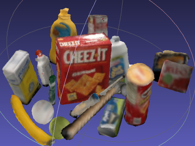
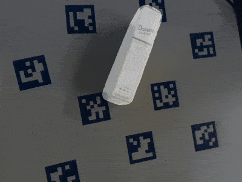
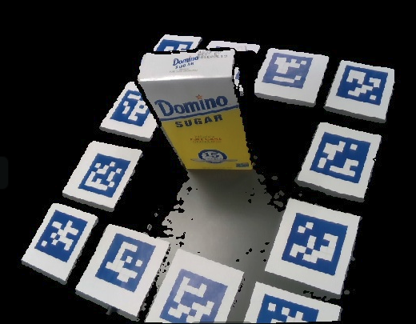
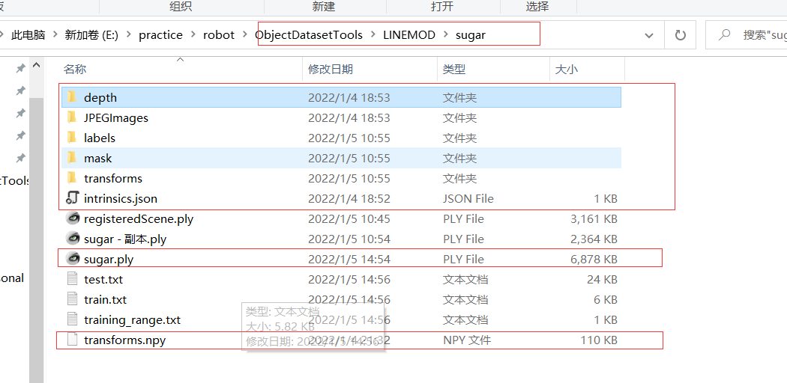
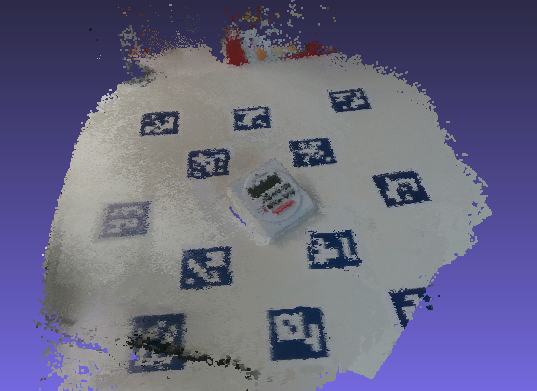
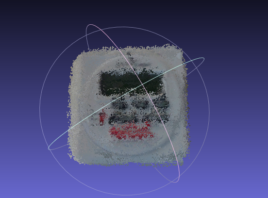
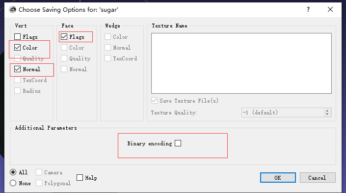
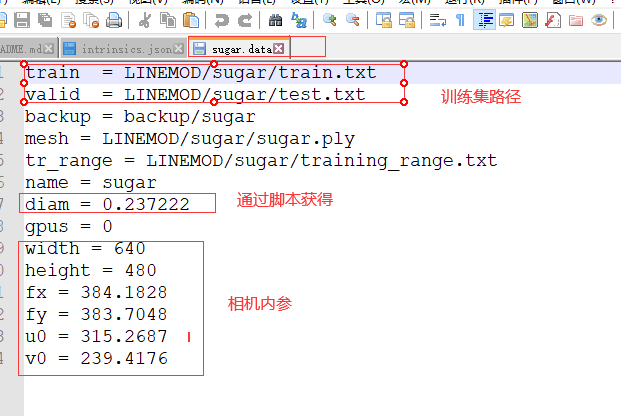

# 6D投影到平面2D坐标生成工具

## 介绍
该库包含纯 python 脚本，用于为使用 RGB-D 相机拍摄的对象序列创建 mask、 bounding box labels 和 3D reconstructed object mesh (.ply)。 该项目可以为各种深度学习项目准备训练和测试数据，例如 6D 对象姿态估计项目 singleshotpose，以及许多对象检测（例如，faster rcnn）和实例分割（例如，mask rcnn）项目。 理想情况下，如果您拥有 realsense 相机并且对 MeshLab 或 Blender 有一定的经验，那么创建自定义数据集应该就像执行几个命令行参数一样简单。

该库中的代码通过 aruco 标记和 ICP 注册实现了原始 3D 模型获取管道。 获得的原始 3D 模型需要在网格处理软件 (MeshLab) 中进行处理和去噪。 在这一步之后，有自动生成所需标签的功能。

这些代码目前是为每帧单个感兴趣的目标编写的。 可以修改它们以创建在一个框架内具有多个目标的数据集。





## 安装
linux: [Installation](doc/installation.md) 这个库的安装已经在的 Ubuntu 16.04 和 Python 2.7 上进行了测试，但也应该与 Python 3 兼容。 包括在各种英特尔 realsense 驱动程序及其 python 包装器上的安装。

windows: 这个库的安装已经在windows10 和 python3.8 上进行了测试。包括 realsense 驱动。

realsense 驱动：https://github.com/IntelRealSense/librealsense/releases/tag/v2.50.0

## 创建自定义数据集

### 1.预先准备
打印 arucomarkers 文件夹下的 arucomarkers.pdf文件 (按照原始大小（无缩放打印），可以黑白/彩色)。在感兴趣目标周围贴上 二维码块。二维码可以随意放置，但是不能重复。(二维码块Id: 1-13)



### 2.拍摄目标视频序列

#### 选项1：使用 realsense 相机录制
该脚本用于使用 realsense 相机记录对象视频序列。 对旧版本的SKD使用 record.py，对 librealsense SDK 2.0 使用 record2.py：
```python
python record2.py LINEMOD/OBJECTNAME
```
e.g.,

```python
python record2.py LINEMOD/sugar
```

用上述命令环绕目标拍摄视频序列。默认情况下，脚本在倒计时5秒后开始录制，且录制时长为40秒。您可以通过按“q”更改录制间隔或者退出录制。请稳定移动相机以获得物体的不同视图，同时保持3-5个二维码块在相机的视野范围内。

注意项目假设所有序列都保存在名为“LINEMOD”的文件夹下，使用其他文件夹名称会导致错误发生。

如果使用 record.py /  record2.py 创建序列，彩色图像、与彩色图像对齐的深度和相机参数将自动保存在序列目录下。



### 选项 2：使用现有视频序列或使用其他摄像机录制
如果您使用其他相机，请将彩色图像（.jpg）放在名为“JPEGImages”的文件夹中，并将对齐的深度图像（在 8m 范围内插值的 uint16 png）放在“depth”文件夹中。请注意，该算法假定深度图像与彩色图像对齐。将您的彩色图像从 0.jpg, 1.jpg ... 800.jpg 和相应的深度图像按顺序命名为 0.png ... 800.png，您还应该在序列目录下创建一个文件内在.json并以如下格式手动输入相机参数：

{"fx": 614.4744262695312, "fy": 614.4745483398438, "height": 480, "width": 640, "ppy": 233.29214477539062, "ppx": 308.8282470703125, "ID": "620201000292"}  
根据自己的相机调整参数

如果你不知道你的相机的内参，你可以粗略估计。所有需要的参数是 fx、fy、cx、cy，其中通常 fx = fy 等于图像的宽度，cx 和 cy 是中心的图像。例如，对于 640 x 480 分辨率的图像，fx、fy = 640、cx = 320、cy = 240。

示例序列可以在这里 [HERE](https://drive.google.com/file/d/1BnW4OMR0UlIsaFAjeBuPWrbDgmqV-AY-/view?usp=sharing) 下载，创建一个名为“LINEMOD”的目录，解压示例序列，并将解压缩的文件夹（计时器）放在 LINEMOD 下。

百度网盘地址 [baidu](https://pan.baidu.com/s/1gQVHUkPPEZPKJaj5zPybcw)
(提取码：gh2f)

### 3.计算每一帧的R，T矩阵
以指定的间隔（可以在 config/registrationParameters 中更改间隔）对第一帧计算帧的变换，将变换矩阵（4*4 齐次矩阵变换）保存为 numpy 数组 (.npy)。

```python
python compute_gt_poses.py LINEMOD/sugar
```

or 

```python
python compute_gt_poses.py all
```

#### 4. 使用所有帧重建物体场景

```python
python register_scene.py LINEMOD/sugar
```

原始的registeredScene.ply 将保存在指定目录下（例如，LINEMOD/sugar）。registerScene.ply 是场景的点云，包括桌面、标记和扫描期间暴露的任何其他对象，并具有一定程度的噪声消除。生成的网格看起来像这样，需要在步骤 5 中手动处理：



或者，您可以尝试通过尝试 register_segmented 而不是 register_scene 来跳过所有手动工作。

```python
python register_segmented.py LINEMOD/sugar
```

默认情况下， register_segmented 尝试删除所有不需要的背景并执行表面重建，将注册的点云转换为三角形网格。如果 MESHING 设置为 false，脚本将仅尝试移除背景并使用平坦表面自动完成看不见的底部（如果 FILLBOTTOM 设置为 true），您将需要执行步骤 5。

但是， register_segmented 可能会失败，因为它使用一些特殊的方法来分割背景，因此您可能需要调整一些参数以使其与您的对象一起使用。要调整的最重要的旋钮是“MAX_RADIUS”，它会切断任何深度读数，其到观察到的 aruco 标记中心的欧几里得距离大于指定值。此值当前设置为 0.2 m，如果您有更大的对象，您可能需要增加此值以不切断对象的一部分。运行 register_segmented 的结果如下所示：



### 5.手动处理注册的点云（可选）
如果您对运行 register_segmented 的结果感到满意，可以跳过步骤 5。
如果您运行 register_scene.py ， 您需要手动处理点云。

注册的点云需要处理为

1) 删除不感兴趣的背景，
2) 执行表面重建并完成缺失的一侧，反之亦然，
3) 处理重建的网格（您可能需要切掉部分并重新完成缺失的一面），
4) 确保处理后的网格没有任何孤立的噪音。

最终产品是三角形网格，而不是算法生成的注册点云。

注意：推荐使用
```python
python register_scene.py LINEMOD/sugar
```
去生成 .ply 文件，然后使用MeshLab工具手动的去除目标之外的其他点云，然后对目标进行重建。


### 6. 重建图像 mask 和 标签文件
当完成步骤1-4之后，运行脚本
```python
python create_label_files.py all
```
or 

```python
python create_label_files.py LINEMOD/sugar
```

此步骤创建一个名为 foldername.ply（例如，sugar.ply）的新点云图，其 AABB 以原点为中心，并且与 OBB 的尺寸相同。它还生成图像 mask（保存在mask文件夹下）、关于新网格的 4 x 4 齐次变换（保存在 transforms文件夹下），以及标签文件（保存在 labels 文件夹下），label文本描述的是 对象的 3D 边界框的投影到2D 图像。mask文件可用于深度学习项目的训练和测试目的（例如，mask rcnn）

通过运行以下命令直观地可视化创建的 3D 边界框和 mask 的正确性：
```python
python inspectMasks.py LINEMOD/sugar
```

### （可选）创建 singleshotpose 项目所需的其他文件
因为 singleshotpose 无法读取二进制编码的网格，所以需要在 meshlab 中打开这些新的网格文件，并通过取消选中二进制格式选项再次保存它们。在导出新的 .ply 文件的时候，勾选 Color Normal Flags，去掉二进制编码。具体如下图所示。



步骤6中创建的 mask 和 label可以用于 singleshotpose 项目。目前，类标签以一种hacky方式分配（例如，按照文件夹在所有序列文件夹中的顺序）。如果您为每个文件夹各自单独调用create_label脚本，他们将被分配相同的标签，因此请阅读打印输出并在create_label.py手动更改类标签。

此外，您还需要通过以下命令创建训练集和测试集
```python
python makeTrainTestfiles.py
```

对于每个自定义目标，在cfg文件夹中创建一个 objectname.data文件
如下图所示



其中 diam 通过脚本 getmeshscale.py 获得
```python
python getmeshscale.py
```

相机内参见 xxx.json

### 可视化目标边界框
完成步骤6之后，运行脚本
```python
python get_BBs.py
```

将会在根目录下创建 annotations.csv 文件，包含LINEMOD文件夹下所有图像的 类别 和 boundding box信息